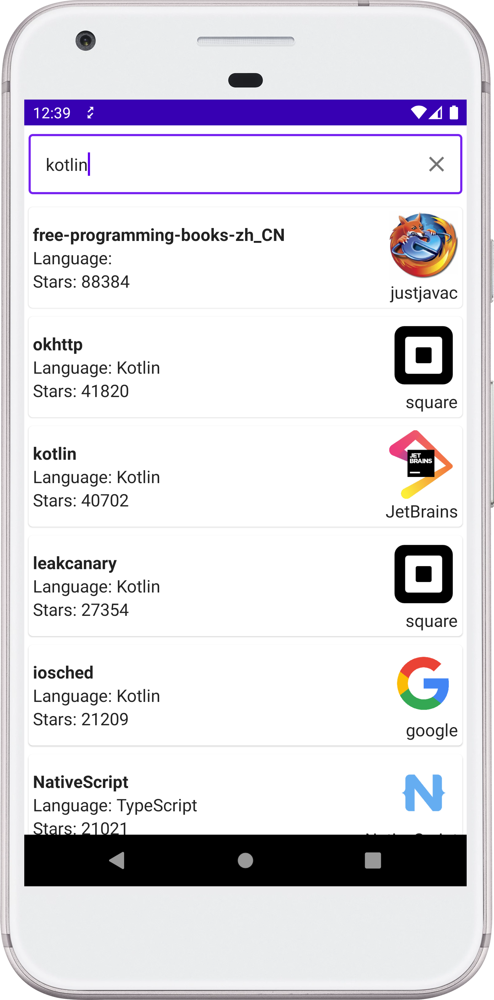

# Github Repo Browse

# Repo Browser
An Android application which allows you to search for repositories on GitHub.

The app provides a search input and lists the found repositories. Sorting order is hard-coded to be by the highest number of stars.

In case there is no internet connection, the app retrieves the repositories stored on the local storage, which are cached from successful remote responses.

  

# Structure
The project is written in Kotlin and uses Gradle build system.

The project contains the following gradle modules:
* app
* domain
* data-android

# Architecture

Tha App follows Google's recommendation on clean app architecture, having separated the presentation, domain and data layer.

#### ::app 
Architecture pattern: Model — View — ViewModel (MVVM)

#### ::domain
Use of Use-cases.

#### ::data-android
Network requests: Retrofit + okHttp

Local storage: RoomDb

Dependecy Injection framework: Hilt

# Testing
Unit tests cover partially domain, data-android, app(in progress) layers. 
Usage of JUnit and [mockk](https://mockk.io/).
